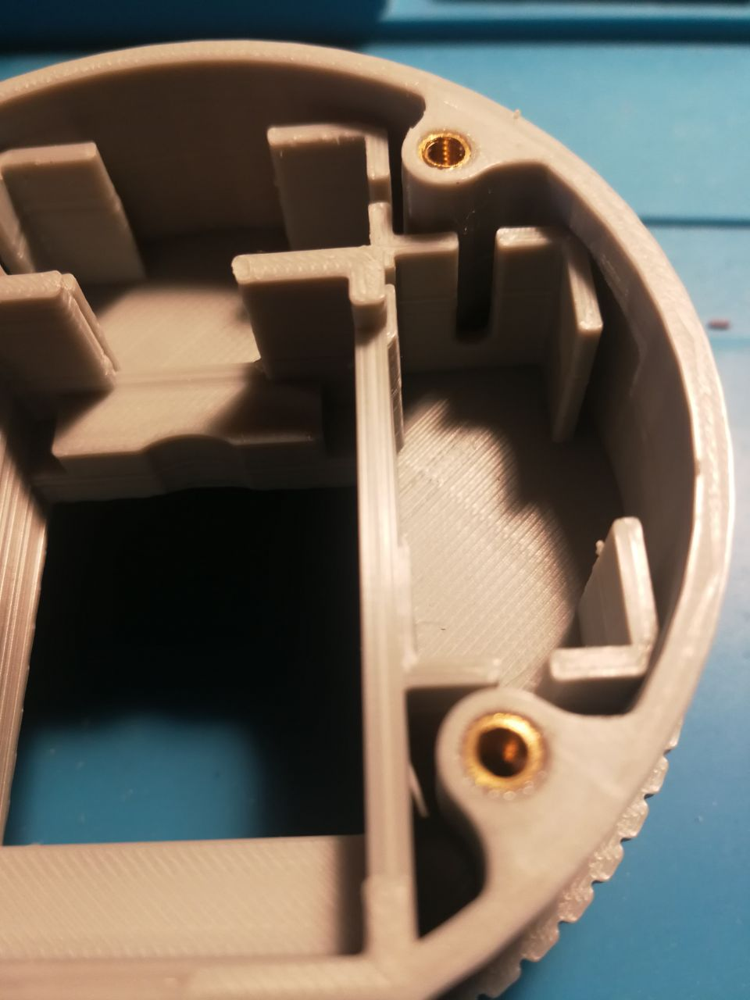

# AI-Meter project

#### Inspired with a project: [AI-on-the-edge-device](https://github.com/jomjol/AI-on-the-edge-device)

## Overview

This project is a try to create a unified platform that can receive and 
handle telemetry data such as water, gas, and electricity meter readings autonomously and in an easily configurable way.

## Features

- Easy configuration and setup
- Modern Web View using [Bootstrap 5](https://getbootstrap.com/docs/5.0/getting-started/introduction/)
- Dynamic web pages with [Jquery](https://jquery.com/) and [CSP](https://github.com/ximtech/CSP) templates
- Telegram integration. Receive meter reading with bot support
- Flexible cron job configuration
- Timezone auto resolving using Geo IP service. Also timezone can be setup from embedded DB
- Using an advanced [Date-time](https://github.com/ximtech/GlobalDateTime) library that supports timezones and DST rules
- Embedded database(Sqlite) that stores timezones and DST rules
- Self-sufficient file server with all containing images, icons, css, js, fonts etc
- Long autonomous work from inner battery (up to 1 year)

## TODO

- Create custom ESP32 cam board with low current consumption ⬜
- File system control in an admin panel ✅
- Tensorflow Lite integration and image recognition ⬜
- Captive portal instead hardcoded IP for web view ⬜
- Wi-Fi password and other sensitive data asymmetric encryption ✅

## Table of Contents

- [How it works](#how-it-works)
  * [First time setup](#first-time-setup)
  * [Workflow](#workflow)
  * [Setup as needed](#setup-as-needed)
- [Software](#software)
  - [SD Card](#sd-card)
  - [Build](#build)
  - [Prerequisites](#prerequisites)
- [Hardware](#hardware)
  * [Adapter board](#adapter-board)
  * [Design notes](#design-notes)
  * [Power supply](#power-supply)
  * [Batteries](#batteries)
  * [External antenna](#external-antenna)
  * [Wiring](#wiring)
- [Housing](#housing)
  - [Water meter case](#water-meter-case)
    - [Assembly](#water-meter-case)
- [Geo IP](#geo-ip)
- [Telegram chat bot](#telegram-chat-bot)
- [Admin page](#admin-page)

## How it works

### First time setup

When `wlan.properties` is empty then a device enables access point witch user can connect and moving step by step set all required parameters.
At the last `summary.csp` page, all steps have been validated and viewed. Also, each item in the list can be changed by clicking on it.
If all ok, then 'Finish' button will be displayed, and after pressing on it, the device enables cron and go to the deep sleep. 

### Workflow

The device takes photos of a meter at a defined cron scheduler.
After initial setup, the device calculates how long need sleep;
then after wakeup it verifies if it's a time and if all ok, then starting job execution.

### Setup as needed

When there is a need to reconfigure or update the device while it is in sleep mode, press config button.
Then wait when led starts blinking and search Wi-Fi access point with name assigned from initial setup.

## Software

## SD Card

The software expects an SD card prepared with certain directory and file structure to work properly.
Card content can be found in `ai-meter -> MCU -> sd-card`.
Just copy all content in properly formatted(see notes) SD card.
As a result in most top directory should look like this: 

#### Notes

- Due to the constrained GPIO availability for components such as OV2640, Flash-Light, PSRAM, and SD card,
  the communication mode with the SD card is confined to 1-line SD-Mode.
  This limitation can cause problems with high-capacity SD cards (64GB, and sometimes 32GB),
  as well as inexpensive, unbranded SD cards.
- Following setting they are necessary for formatting the SD-card: SINGLE PARTITION, MBR, FAT32—32K. NOT exFAT

#### Format example

### Build

### Prerequisites

- Esp-idf and Platformio should be already installed

The most common way to get firmware is to build it from sources:
- Clone this repository and open `MCU` directory as a project:
- In `Visual Studio Code` -> Open Folder -> MCU
- Then run PlatformIO build:  
  
- If all ok, plug the device: 
  
- Then upload firmware
- When the process is finished, turn on the monitor to see log outputs: 
  
- By default, console log enabled and `debug` level is set (can be changed in config)

## Hardware

- ESP32 CAM Camera Module Kit
- OV2640 Camera Module, 120 or 160 Degree, 2MP
- External 4 or 8 MB PSRAM
- Micro SD card from 2 to 8 GB
- USB download board
- Battery power supply, adapter board (see below)

### Adapter board

ESP32 module kit does not support to be powered from batteries by default.
So to use the device autonomously without an external power supply, there is a need to update `USB download board`
to a custom solution.
The directory `esp32-cam-shield` is an Altium project that contains all sources for this board.

The PCB contains: 
- Almost all parts from the original `USB download board`
- Li-ion charger
- Battery protection
- Step-down converter

Altium project also already contains prepared fabrication files (gerber files, NC drill etc.) in one archive `esp32-cam-shield.rar`
Just place it, for example, in jlcpcb quote as follows:

More info (schematic, PCB, BOM etc.) in `esp32-cam-shield` project

### Design notes

- For current housing, push button and switch should be used as follows: 
 

#### 3x4x2 mm SMD Switch 4 Pin Micro Switch Push Button

 

#### Mini Slide Switch On-OFF 2 positions, 7 pins

### Power supply

With the adapter board, there are two types of power supply available: 
- External 5V via USB and should support minimum 500mA. Solder two pins together to switch external power supply: 

- From inner li-ion battery, also can be charged from USB. Solder this pins: 

### Batteries

- Type: 13300
- Size: 13mm x 30mm
- Li-ion 3.7V 400mAh
- Count: 3

Such batteries are widely used at one-time vapes and can be extracted from used electronic smoke.

### External antenna

***Optional***, but highly recommended to use external antenna,
because using an external antenna can solve problems related to connectivity problems and speed up data transmission.

- Take a look at your board to see if it is set to use the on-board antenna or the IPEX connector. 

- To enable or disable the on-board antenna, you just need to unsolder that resistor and solder it in the desired configuration. 
You can also drop some solder to connect those points (you don’t necessarily need to add the resistor as long as the pads are connected)
- Next, there is a need to connect flexible patch antenna with cable length about 10 cm: 

## Wiring

After soldering all together, it should look like on a photo: 
 

## Housing

---

## Water meter case

The `3D Model` directory contains `SolidWorks` source models for 3D printing.
All that needs to be printed for a single device from `water` directory:
- 1x -`Base.SLDASM` -> ***Resolution: 0.2, Walls: 2–3, Infill: 20%+, Supports: Yes, Filament material: PLA***
- 3x -`Battery_Lid.SLDASM` -> ***Resolution: 0.2, Walls: 2, Infill: 100%, Supports: No, Filament material: PLA***
- 1x -`Button.SLDASM` -> ***Resolution: 0.12, Walls: 2, Infill: 100%, Supports: No, Filament material: PLA***
- 1x -`Flash_Reflector.SLDASM` -> ***Resolution: 0.12, Walls: 2, Infill: 50%+, Supports: No, Filament material: Transparent PLA***
- 1x -`Led_Pipe.SLDASM` -> ***Resolution: 0.12, Walls: 2, Infill: 100%, Supports: No, Filament material: Transparent PLA***
- 1x -`Holder.SLDASM` -> ***Resolution: 0.2, Walls: 2–3, Infill: 20%+, Supports: No, Filament material: PLA***
- 1x -`Lid.SLDASM` -> ***Resolution: 0.2, Walls: 2–3, Infill: 20%+, Supports: No, Filament material: PLA***
- 1x -`On_Off_Switch.SLDASM` -> ***Resolution: 0.12, Walls: 2, Infill: 100%, Supports: No, Filament material: PLA***

## Assembly

### Prerequisites

- 4x - ***M3 Brass inserts: 5–8mm tall***
- 20x - ***3x2mm Round neodymium magnets*** 

### 1. Melt brass inserts into the base holes

### 2. Insert contact magnets to base and holder

***Note:*** Place magnets according to a letter on the case: `S` -> indicating that the south pole should be facing upward. 

### 3. Place reflector

### 4. Place and then solder battery wires

***Note: Connect all batteries in parallel***

### 5. Cover batteries

### 6. Place PCB

### 7. Place on/off switch, button and led pipe

### 8. Screw up the lid

### 9. Mounting

---

## Geo IP

Register and get IP geolocation API token: [link](https://ipgeolocation.io/)

## Telegram chat bot

How to create a Telegram bot: [link](https://www.directual.com/lesson-library/how-to-create-a-telegram-bot)

## Admin page

Access the admin page through the following link: `http://192.168.4.1/admin` 
 